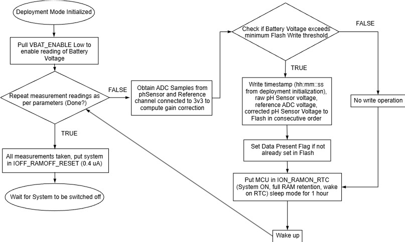
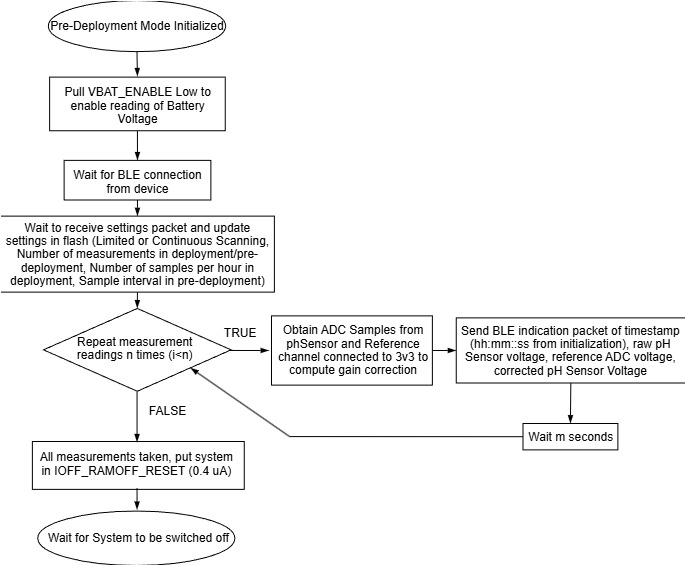
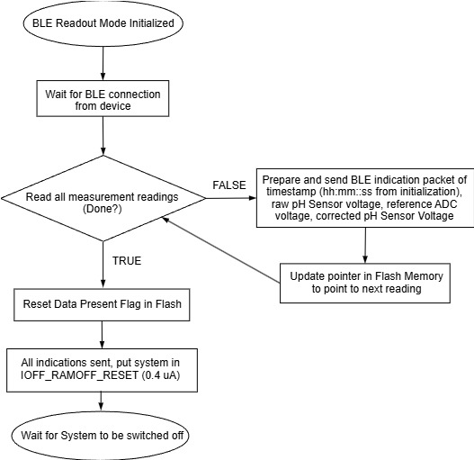

# YSZ pH Sensor XIAO nRF52840  

The XIAO nRF52840 in this project receives analog Data from the Analog Front End (AFE), which interfaces with pH and reference electrodes, saves the data to an external QSPI Flash memory and can later send the data wirelessly to a Webapp via BLE. 

[Link to webapp](https://prasana-sys.github.io/ysz_phSensor_Xiao_nRF52840/)  

## Features
- Reads analog voltage from a pH sensor and reference electrode
- Stores measurements on external QSPI Flash memory
- Supports BLE communication for wireless data transfer to a web app
- Configurable measurement intervals and deployment modes
- Low-power standby using `sd_power_system_off()`

## How to compile and use  
Download Arduino IDE 2.3.5 (or higher)  
Delete local SdFat library that comes pre-installed with Arduino IDE  
> Usually in /Documents/Arduino/libraries/SdFat  

Navigate to File > Preferences, and fill "Additional Boards Manager URLs" with the url below:  
https://files.seeedstudio.com/arduino/package_seeeduino_boards_index.json  

Open Boards Manager in Arduino IDE and install "Seeed nRF52 Boards" Board Support Package (BSP). This repo is guaranteed to work with BSP version 1.1.11.  

Do not install the mbed-enabled BSP and if modifying code in this repo, only use the libraries provided in the non-mbed BSP!  

After installing the board package, navigate to Tools > Board and select "Seeed XIAO nRF52840".  

Do not modify file structure, i.e., maintain /src/MODULE_NAME/src/FILES_HERE for submodules to compile along with .ino file.

## Uploading Firmware
1. Connect the XIAO nRF52840 via USB.
2. Select correct COM port in Arduino IDE.
3. Click “Upload”.
4. If upload fails, double-press reset button to enter bootloader mode.

## How to setup device
Use SdFat_Format.ino script in `SdFat_Format/` directory to format QSPI flash (P25Q16H) with a new empty FAT12 filesystem. This will enable the flash to be read as a disk drive (USB Flash Drive) by computers. Follow the onscreen instructions in the serial terminal to complete the formatting.  

After formatting is complete, copy the settings.ini file into the root directory of the USB Flash Drive (D:/). Do not change settings.ini file contents directly. Use the webapp to do so.  

After deployment is complete make sure to plug in the XIAO to a computer to delete the log.csv file. Failure to do so will make the pre-deployment mode inaccessible.  

## Hardware Connections
| Component | XIAO Pin | Description |
|------------|-----------|-------------|
| pH Sensor ADC | A0 | Analog input |
| AFE Enable Pin | D7 | Digital Output |
| Deployment Switch | D1 | Digital Input |
| Battery | BAT | Power supply |

## State Diagrams and Flowcharts

### State Diagram


### Flowcharts




## **LED Status Indicators**

| State / Event | LED Color & Behavior | Description |
|----------------|----------------------|--------------|
| **Charging** | Small **Green** LED ON | Indicates battery is charging. LED turns **OFF** once fully charged. |
| **Entering Deployment Mode** | **White** LED flashes **three times** | Confirms transition into Deployment Mode. |
| **Pre-Deployment Mode (Idle)** | **Green** LED ON (steady) | Indicates device is in Pre-Deployment mode. |
| **Pre-Deployment Mode (Advertising)** | **Cyan** LED flashing (Green + Blue) | Device is advertising BLE connection during Pre-Deployment. |
| **BLE Readout Mode (Idle)** | **Blue** LED ON (steady) | Indicates device is in BLE Readout mode. |
| **BLE Readout Mode (Advertising)** | **Blue** LED flashing | Device is advertising BLE connection during Readout mode. |
| **Fatal Error** | **Red** LED ON (steady) | Indicates a critical fault. **Power off completely** to reset the device. |

## GATT Services and Characteristics

### **BLE Readout Mode**
| Service | UUID | Characteristic | UUID | Properties | Description |
|----------|------|----------------|------|-------------|--------------|
| **pH Measurement Service (PMS)** | `019A2890-2324-7D95-8F76-8DE7146B560E` | **Log Entry** | `019A2896-2324-7D95-8F76-8DE7146B560E` | *Indicate (char \*)* | Sends logged pH data entries from flash memory to the client. |
|  |  | **Command** | `019A2991-2324-7D95-8F76-8DE7146B560E` | *Write (uint8)* | Used by the client to control the readout process (e.g., start transfer). |

---

### **Pre-Deployment Mode**
| Service | UUID | Characteristic | UUID | Properties | Description |
|----------|------|----------------|------|-------------|--------------|
| **pH Measurement Service (PMS)** | `019A2890-2324-7D95-8F76-8DE7146B560E` | **Log Entry** | `019A2896-2324-7D95-8F76-8DE7146B560E` | *Indicate (char \*)* | Used to stream real-time pH samples before deployment. |
| **Configuration Service (CS)** | `019A2990-2324-7D95-8F76-8DE7146B560E` | **Command** | `019A2991-2324-7D95-8F76-8DE7146B560E` | *Write (uint8)* | Used to send configuration commands such as **SAVE SETTINGS**, **RESET SETTINGS** or **CONTINUE**. |
|  |  | **continuousScanningDeployment** | `019A2992-2324-7D95-8F76-8DE7146B560E` | *Read / Write (bool)* | Enables or disables continuous scanning during deployment. 0 = Limited measurements, 1 = Continuous measurements |
|  |  | **numberMeasurementsDeployment** | `019A2993-2324-7D95-8F76-8DE7146B560E` | *Read / Write (uint32)* | Number of measurements to take during deployment. |
|  |  | **numberMeasurementsPreDeployment** | `019A2994-2324-7D95-8F76-8DE7146B560E` | *Read / Write (uint32)* | Number of measurements to take during pre-deployment. |
|  |  | **sampleIntervalDeployment** | `019A2995-2324-7D95-8F76-8DE7146B560E` | *Read / Write (uint32)* | Sampling interval in seconds during deployment. |
|  |  | **sampleIntervalPreDeployment** | `019A2996-2324-7D95-8F76-8DE7146B560E` | *Read / Write (uint8)* | Sampling interval in seconds during pre-deployment. |
|  |  | **startDelayDeployment** | `019A2997-2324-7D95-8F76-8DE7146B560E` | *Read / Write (uint32)* | Delay in seconds before taking first measurement in deployment. |

## Command Bytes

| Command Code | Mode | Description |
|---------------|------|-------------|
| `0x01` | Pre-Deployment Only | **Save Settings** – Write settings sent via BLE to Flash memory. |
| `0x02` | Pre-Deployment Only | **Continue** – Continue to the Pre-Deployment measurement loop. |
| `0x03` | Pre-Deployment Only | **Reset Settings** – Reset all configuration parameters to defaults in Flash memory. |
| `0x04` | Both Modes | **Ping Device** – Sends `0xAB` in Pre-Deployment mode and `0xCD` in BLE Readout mode to confirm communication. |
| `0x12` | BLE Readout Only | **Start Transfer** – Begins CSV log data transfer, each line terminated by `'\n'`, sent via the Log Entry characteristic. |

## Default Settings

 - DEFAULT_CONTINUOUS_SCANNING_DEPLOYMENT = 0 (Limited Number of Scans)  
 - DEFAULT_START_DELAY_DEPLOYMENT = 600 (10 minutes)
 - DEFAULT_NUMBER_MEASUREMENTS_DEPLOYMENT = 24  
 - DEFAULT_NUMBER_MEASUREMENTS_PRE_DEPLOYMENT = 10  
 - DEFAULT_SAMPLE_INTERVAL_DEPLOYMENT = 3600 (1 hour)  
 - DEFAULT_SAMPLE_INTERVAL_PRE_DEPLOYMENT = 10 (10 seconds)  

## Useful links:

https://wiki.seeedstudio.com/XIAO_BLE/  
https://github.com/Seeed-Studio/Adafruit_nRF52_Arduino  
https://github.com/0hotpotman0/BLE_52840_Core

## OLD Compilation Instructions (DO NOT USE)  

Add this line of code to ```C:\Users\[USERNAME]\AppData\Local\Arduino15\packages\Seeeduino\hardware\nrf52\1.1.10\libraries\Adafruit_SPIFlash\src\flash_devices.h``` at the end

```// Settings for the Puya Semiconductor P25Q16H 2MiB QSPI flash.
// Datasheet:
// https://www.puyasemi.com/uploadfiles/2021/12/202112201130233023.pdf
#define P25Q16H                                                                \
  {                                                                            \
    .total_size = (1 << 21), /* 2 MiB */                                       \
        .start_up_time_us = 5000, .manufacturer_id = 0x85,                     \
    .memory_type = 0x60, .capacity = 0x15, .max_clock_speed_mhz = 104,         \
    .quad_enable_bit_mask = 0x02, .has_sector_protection = false,              \
    .supports_fast_read = true, .supports_qspi = true,                         \
    .supports_qspi_writes = true, .write_status_register_split = false,        \
    .single_status_byte = false, .is_fram = false,                             \
  } 
```

https://github.com/adafruit/Adafruit_SPIFlash/blob/master/src/flash_devices.h

Also this line in ```C:\Users\[USERNAME]\AppData\Local\Arduino15\packages\Seeeduino\hardware\nrf52\1.1.10\libraries\Adafruit_SPIFlash\src\Adafruit_SPIFlashBase.cpp```

```
/// List of all possible flash devices used by Adafruit boards
static const SPIFlash_Device_t possible_devices[] = {
    // Main devices used in current Adafruit products
    GD25Q16C, GD25Q32C, GD25Q64C, S25FL116K, S25FL216K,

    // Only a handful of production run
    W25Q16FW, W25Q64JV_IQ,

    // Fujitsu FRAM
    MB85RS64V, MB85RS1MT, MB85RS2MTA, MB85RS4MT,

    // Other common flash devices
    W25Q16JV_IQ, W25Q32JV_IQ, AT25SF041, AT25DF081A, P25Q16H};

```